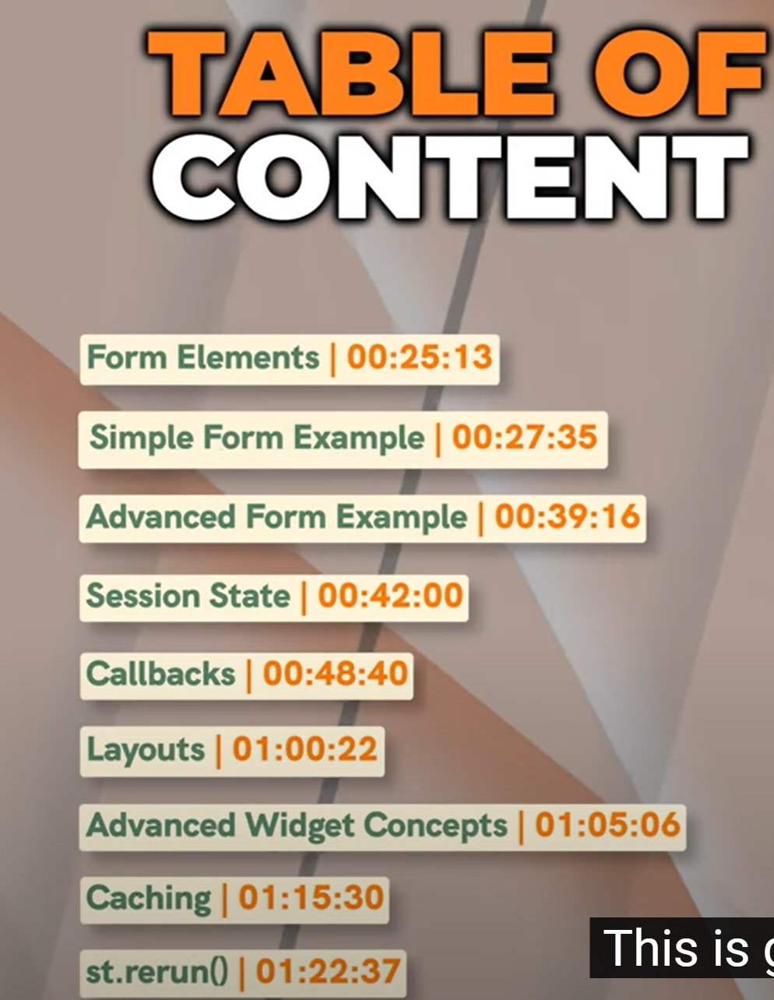

About Streamlit :streamlit: Mini 

Learn Streamlit basics fast! Just browse from the sidebar and find (Ctrl-f) what you need to create your Streamlit app. Remeber to click the button at the page top to view the source code :smile:.

This is a **loose** implementation following the YouTube [Streamlit Mini Course](https://www.youtube.com/watch?v=o8p7uQCGD0U). 

This course covers various topics that should be well-rounded for a Streamlit developer.

Why Streamlit?

It is one if not the fastest free Python web framework with an aesthetic display, built-in ready useful elements and resonates with an intuitive coding feel.

Use Streamlit to do good or nothing bad at least.

Enjoy!

